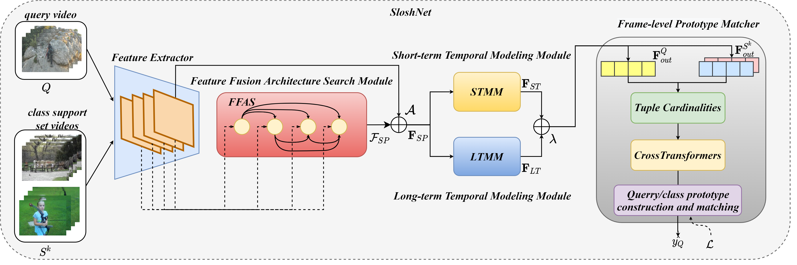

# AAAI2023: Revisiting the Spatial and Temporal Modeling for Few-shot Action Recognition(SloshNet) [[arXiv]](https://arxiv.org/abs/2301.07944) 


## Overview


## Content 
- [Prerequisites](#prerequisites)
- [Data Preparation](#data-preparation)
- [Training](#training)
- [Testing](#testing)
- [Citing_SloshNet](#Citing_SloshNet)
- [Acknowledgments](#Acknowledgments)

## Prerequisites

The code is built with following libraries:

- [PyTorch](https://pytorch.org/) >= 1.8
- tensorboardX
- pprint
- tqdm
- dotmap
- yaml
- csv

For video data pre-processing, you may need [ffmpeg](https://www.ffmpeg.org/).

More detail information about libraries see [INSTALL.md](INSTALL.md).

## Data Preparation
We need to first extract videos into frames for fast reading. Please refer to [TSN](https://github.com/yjxiong/temporal-segment-networks) repo for the detailed guide of data pre-processing.
We have successfully trained on [Kinetics](https://deepmind.com/research/open-source/open-source-datasets/kinetics/), [SthV2](https://developer.qualcomm.com/software/ai-datasets/something-something) ,[UCF101](http://crcv.ucf.edu/data/UCF101.php), [HMDB51](http://serre-lab.clps.brown.edu/resource/hmdb-a-large-human-motion-database/). 

## Training
We provided several examples to train STM with this repo:
- To train on  Kinetics or SthV2 or Hmdb51 or UCF101 from Imagenet pretrained models, you can run:
```
# train Kinetics
 bash ./scripts/train_kin-1s.sh 

# train SthV2
 bash ./scripts/train_ssv2-1s.sh 

# train HMDB
bash ./scripts/train_hmdb-1s.sh 

# train UCF
bash ./scripts/train_ucf-1s.sh 
 ```
## Testing
To test the trained models, you can run `scripts/run_test.sh`. For example:
```
bash ./scripts/test.sh
```
## Citing SloshNet
If you find SloshNet useful in your research, please cite our paper.

## Acknowledgments
Our code is based on [TRX](https://github.com/tobyperrett/trx).
